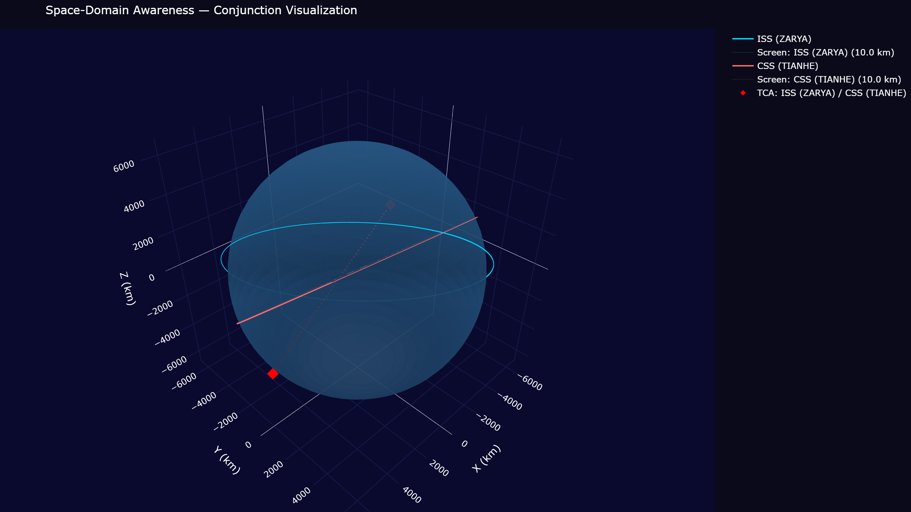
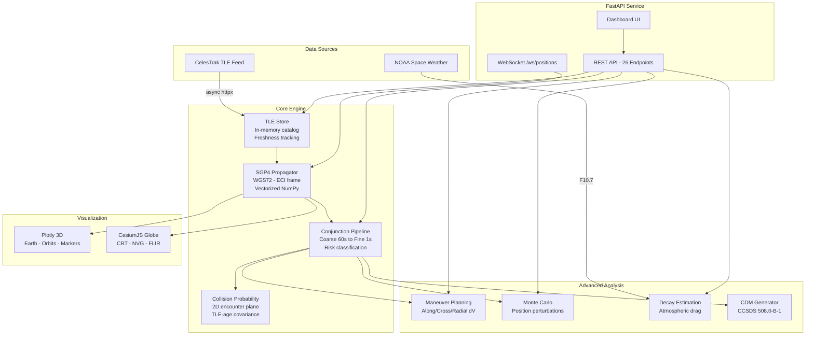

# Space-Domain Awareness Collision Predictor

**Satellite conjunction analysis engine** — SGP4 orbital propagation, two-phase collision screening, collision probability computation, maneuver planning, and interactive 3D visualization.

[](https://github.com/jdardash/space-collision-predictor/actions)
[](https://codecov.io/gh/jdardash/space-collision-predictor)
[](https://python.org)
[](https://pypi.org/project/sgp4/)
[](LICENSE)

---



---

## What It Does

Ingests **Two-Line Element sets (TLEs)** from CelesTrak, propagates orbits with **SGP4**, screens all satellite pairs for close approaches, computes collision probability with TLE-age-scaled covariance, and generates avoidance maneuver options — all served over a FastAPI REST/WebSocket API with a built-in 3D dashboard.

| Feature | Description |
| ------- | ----------- |
| **SGP4 Propagation** | WGS72 gravity model, ECI (TEME) frame, vectorized NumPy batch mode |
| **Two-Phase Conjunction Detection** | Coarse screen (60 s steps) then fine refinement (1 s steps) around candidate TCAs |
| **Collision Probability (Pc)** | 2D encounter-plane method (Chan / Alfano), Bessel I0 integration, TLE-age-scaled covariance |
| **Risk Classification** | Five-level assessment: CRITICAL / HIGH / MODERATE / LOW / NEGLIGIBLE |
| **Maneuver Planning** | Along-track, cross-track, and radial delta-V options per lead time |
| **Monte Carlo Analysis** | Gaussian position-noise miss-distance distributions; cross-check for the analytic Pc |
| **Orbital Decay Estimation** | Harris-Priester-style atmospheric model with F10.7 solar-flux scaling |
| **CCSDS CDM Generation** | Conjunction Data Messages per CCSDS 508.0-B-1 |
| **3D Visualization** | Plotly Earth + orbits + screening volumes; CesiumJS globe with CRT/NVG/FLIR filters |
| **Live Data** | Async CelesTrak multi-group fetch, NOAA space weather, background refresh |
| **WebSocket Streaming** | Real-time satellite positions (lat/lon/alt/velocity) |

---

## Quick Start

```bash
git clone https://github.com/jdardash/space-collision-predictor.git
cd space-collision-predictor
python -m venv .venv && source .venv/bin/activate  # .venv\Scripts\activate on Windows
pip install -e ".[dev]"
python -m sda.api
```

Open [localhost:8000](http://localhost:8000) — the server starts instantly with a bundled demo catalog, then seeds live data from CelesTrak in the background. Interactive API docs at [localhost:8000/docs](http://localhost:8000/docs).

> PyPI publication is planned; until then, install from source as above.

### Docker

```bash
docker compose up --build
# -> http://localhost:8000
```

### Make Targets

```bash
make dev        # Install with dev dependencies
make test       # Run tests (fail-fast)
make cov        # Coverage report with HTML output
make lint       # ruff + mypy
make serve      # Start FastAPI dev server
make benchmark  # Run propagation benchmark
make docker     # Build and run via Docker
```

---

## Architecture



### Module Map

| Module | Purpose |
| ------ | ------- |
| `propagator.py` | SGP4 wrapper: `(jd, fr)` Julian date handling, ECI propagation, vectorized NumPy mode |
| `conjunction.py` | Two-phase detection pipeline, risk classification, event history |
| `probability.py` | 2D Pc: encounter-plane projection, Bessel I0 integration, TLE-age sigma scaling |
| `tle_store.py` | In-memory TLE catalog, 2/3-line parser, freshness tracking |
| `maneuver.py` | Orbital elements extraction, along/cross/radial delta-V options |
| `montecarlo.py` | Gaussian position-noise miss-distance distributions |
| `decay.py` | Atmospheric density model, F10.7 scaling, lifetime estimation |
| `cdm.py` | CCSDS 508.0-B-1 conjunction data messages |
| `constants.py` | Shared WGS72 physical constants (matching SGP4 internals) |
| `visualization.py` | Plotly 3D Earth, orbit traces, screening volumes |
| `routes/` | FastAPI routers: satellites, conjunctions, analysis, system, worldview |
| `templates/` | Dashboard and CesiumJS WorldView HTML |
| `models.py` | Pydantic data models (TLERecord, StateVector, ConjunctionEvent, ...) |
| `api.py` | App assembly, lifespan, CelesTrak/NOAA background tasks |

---

## API Reference

26 REST endpoints + 1 WebSocket — auto-generated docs at **/docs** (Swagger UI) and **/redoc**.

| Method | Endpoint | Description |
| ------ | -------- | ----------- |
| `GET` | `/` | Web dashboard |
| `GET` | `/worldview` | CesiumJS 3D globe |
| `GET` | `/health` | System health + satellite count + uptime |
| `GET` | `/metrics` | Performance counters |
| `GET` | `/space-weather` | Live NOAA solar/geomagnetic data |
| `GET` | `/satellites` | List all tracked satellites |
| `GET` | `/satellites/{norad_id}` | Detail + current state vector + freshness |
| `DELETE` | `/satellites/{norad_id}` | Remove from tracking |
| `GET` | `/satellites/{norad_id}/decay` | Orbital lifetime estimate |
| `POST` | `/tle` | Ingest TLE text |
| `GET` | `/tle/freshness` | TLE age + accuracy warnings |
| `GET` | `/tle/stale` | Filter by staleness threshold |
| `POST` | `/tle/refresh` | Fetch live data from CelesTrak |
| `POST` | `/conjunctions` | Run conjunction analysis |
| `GET` | `/conjunctions/history` | Historical events (bounded deque, 1000 max) |
| `DELETE` | `/conjunctions/history` | Clear event history |
| `GET` | `/conjunctions/visualize` | Interactive 3D Plotly visualization |
| `POST` | `/conjunctions/cdm` | CCSDS CDM batch generation |
| `POST` | `/maneuver` | Avoidance delta-V planning |
| `POST` | `/montecarlo` | Miss-distance Monte Carlo simulation |
| `GET` | `/api/satellite-positions` | WorldView: current positions |
| `GET` | `/api/satellite-orbits` | WorldView: orbit traces |
| `GET` | `/api/flights` | WorldView: live flight overlay |
| `GET` | `/api/earthquakes` | WorldView: USGS earthquake overlay |
| `POST` | `/api/conjunction-globe-data` | WorldView: conjunction globe overlay |
| `POST` | `/api/conjunction-pc-history` | WorldView: Pc history series |
| `WS` | `/ws/positions` | Real-time satellite position stream |

---

## Risk Classification

| Miss Distance | Relative Velocity | Risk Level |
| :---: | :---: | :---: |
| < 0.5 km | any | **CRITICAL** |
| < 1.0 km | any | **HIGH** |
| < 5.0 km | > 10 km/s | **HIGH** |
| < 5.0 km | <= 10 km/s | **MODERATE** |
| < 10.0 km | any | **LOW** |
| >= 10.0 km | any | **NEGLIGIBLE** |

---

## Collision Probability

2D short-term-encounter method in the tradition of Foster & Estes (1992), Chan (2008), and Alfano (2005):

1. Project the miss vector onto the encounter plane (perpendicular to relative velocity)
2. Combine per-object position covariances: sigma = sqrt(sigma1^2 + sigma2^2)
3. Integrate the 2D Gaussian over the circular hard-body cross-section (default combined radius 20 m)
4. Radial integration uses the modified Bessel function I0 (Abramowitz & Stegun 9.8.1-2)

**Covariance model:** TLEs carry no covariance, so an isotropic synthetic sigma is used, scaled with TLE epoch age following Vallado (2013, Ch. 9) — 50 m for a fresh TLE, growing to ~500 m at 3 days. Note the well-known *probability dilution* property of 2D Pc: for very stale data, larger sigma can decrease reported Pc; miss distance and risk level are therefore always reported alongside Pc.

---

## Validation & Accuracy

- **Propagation** delegates to [python-sgp4](https://github.com/brandon-rhodes/python-sgp4), which is verified against the official Vallado et al. (2006) reference implementation of SGP4 (agreement to ~0.1 mm). This project pins the **WGS72** gravity model and the `(jd, fr)` split Julian-date convention throughout; shared constants in `constants.py` match `sgp4`'s internal WGS72 values exactly.
- **Frames:** all positions/velocities are ECI (TEME) in km and km/s. Geodetic conversion (WGS84 ellipsoid) is used only for map display, never in conjunction math.
- **Pc cross-check:** the `/montecarlo` endpoint provides an independent sampled estimate of collision probability for comparison against the analytic 2D Pc.
- **Test suite:** 110+ offline-deterministic tests covering LEO propagation bounds, Julian-date roundtrips, all risk-classification branches, Pc bounds and Bessel accuracy, maneuver physics, and every API endpoint via TestClient.

### Benchmark

Measured output of `make benchmark` (Python 3.13, Windows 11, Ryzen-class laptop CPU):

```text
ISS orbit propagation: 1441 steps (24h @ 60s)
  Loop mode:           4.9 ms avg  (4.1 ms best)
  Vectorized mode:     2.0 ms avg  (1.8 ms best)
  Speedup:         2.5x

Fine propagation: 601 steps (10 min @ 1s)
  Loop mode:           1.6 ms avg
  Vectorized mode:     0.7 ms avg
  Speedup:         2.2x

Screening 2 satellites (1 pairs) over 24h:
  Total propagation: 3.4 ms
  Per satellite:     1.7 ms
```

Run `make benchmark` to reproduce on your hardware.

---

## Disclaimer

This tool is for **research and education**. It must not be used as a sole source of truth for operational collision-avoidance decisions:

- TLE-based screening carries **km-level position uncertainty** that grows with TLE age (roughly 1-3 km/day for LEO).
- TLEs provide no covariance; the Pc covariance here is a synthetic empirical model.
- The atmospheric decay and maneuver models are simplified first-order approximations.

Operational conjunction assessment uses owner/operator ephemerides, calibrated covariances, and validated tools (e.g., NASA CARA). See [SECURITY.md](SECURITY.md) for the safety-critical component list.

---

## Testing

```bash
pytest tests/ -x --tb=short          # Fast, fail-first
pytest tests/ --cov=src/sda          # With coverage
make lint                            # ruff + mypy
```

| Module | Coverage Target |
| ------ | --------------- |
| propagator | 90% |
| tle_store | 90% |
| conjunction | 85% |
| probability | 85% |
| api | 80% |
| maneuver / decay / montecarlo | 80% |

---

## Deployment

```bash
# Railway
railway login && railway init && railway up

# Fly.io
fly launch && fly deploy
```

The `Dockerfile` includes a container health check. No environment variables are required — the app starts with a bundled demo catalog and seeds live CelesTrak data in the background.

---

## Tech Stack

| Component | Library | Purpose |
| --------- | ------- | ------- |
| Propagation | **sgp4** | NORAD SGP4/SDP4 (WGS72 gravity) |
| Numerics | **NumPy** | Vectorized orbital computations |
| API | **FastAPI** + **Uvicorn** | Async REST + WebSocket |
| Validation | **Pydantic** | Data models + serialization |
| HTTP Client | **httpx** | Async CelesTrak/NOAA integration |
| 3D Viz | **Plotly** | Interactive orbit visualization |

---

## References

- D. Vallado, P. Crawford, R. Hujsak, T.S. Kelso, "Revisiting Spacetrack Report #3," *AIAA/AAS Astrodynamics Specialist Conference*, 2006 (AIAA 2006-6753).
- S. Alfano, "A Numerical Implementation of Spherical Object Collision Probability," *Journal of the Astronautical Sciences*, Vol. 53, No. 1, 2005.
- J.L. Foster and H.S. Estes, "A Parametric Analysis of Orbital Debris Collision Probability and Maneuver Rate for Space Vehicles," NASA JSC-25898, 1992.
- F.K. Chan, *Spacecraft Collision Probability*, The Aerospace Press, 2008.
- D. Vallado, *Fundamentals of Astrodynamics and Applications*, 4th Ed., Microcosm Press, 2013.
- M. Abramowitz & I. Stegun, *Handbook of Mathematical Functions*, Dover, 1965. Section 9.8 (Bessel functions).
- CCSDS 508.0-B-1, *Conjunction Data Message*, Recommended Standard, 2013.

## Citing

If you use this software in research, see [CITATION.cff](CITATION.cff) or use GitHub's "Cite this repository" button.

---

## Contributing

See [CONTRIBUTING.md](CONTRIBUTING.md) for development setup, coding standards, and PR guidelines. This project follows the [Contributor Covenant Code of Conduct](CODE_OF_CONDUCT.md). Security policy: [SECURITY.md](SECURITY.md).

---

## License

[MIT](LICENSE)
